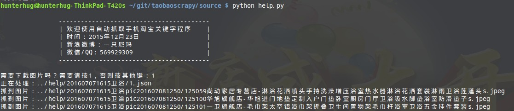
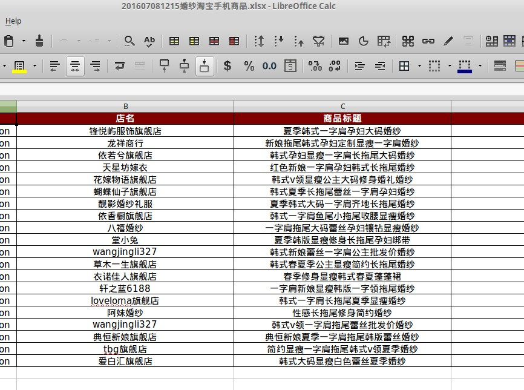

# 天猫淘宝关键字商品搜索说明

```
一个抓取淘宝的Python爬虫
---------------------------------------------------------

一个抓取淘宝天猫关键字搜索商品的爬虫使用python3.4，爬虫程序已经封装好
支持抓取商品标题/商品价格/商品销量/商品图片等
使用请直接点击exe文件夹中后缀为exe的文件或者run.bat

------------------------------------------------------------

A scarpy for catch taobao item info
using python3
run just click exe/*.exe
more please watch the pdf
```

>更多说明参考pdf

>更多说明参考pdf

>更多说明参考pdf

>更多说明参考pdf


# 一.项目结构

```
-----taobaocomment
	-------source	源代码
	-------data 原始数据
	-------image 你要的图片
	-------excel	你要的结果
	-------exe.rar	请解压变成exe
	-------exehelp.rar	请解压变成exehelp
	-------run.bat	你要跑的脚本
	-------runhelp.bat 
```

# 二.Docker版环境

Docker版安装：

拉镜像

```
docker pull python

```

在本项目要下启动并挂载盘

```
docker run --rm -it -v $PWD:/taobao --name="my-python" python /bin/bash
```

`$PWD:/taobaoscrpy`将本项目挂在容器文件夹下`/taobao`

然后

```
root@7b5d59c077ed:/taobaoscrpy# cd /taobao/
root@7b5d59c077ed:/taobaoscrpy# python source/mtaobao.py 
Traceback (most recent call last):
  File "source/mtaobao.py", line 6, in <module>
    import xlsxwriter as wx
ModuleNotFoundError: No module named 'xlsxwriter'

# 缺啥就pip3啥，但是这样每次都很慢
```

所以请不要`docker pull`，而是自己`build`!

build:

```
docker build -t mypython .
```

然后:

```
docker run --rm -it -v $PWD:/taobao --name="my-python" mypython /bin/bash

cd /taobao/source
python mtaobao.py
```

杀docker容器请使用

```
docker kill my-python
```
# 二.环境准备

安装[python3](https://www.python.org/downloads/)。然后设置环境变量设置。

## 1.安装依赖模块

依赖模块有`pymysql`, `xlswriter`, `bs4`

```
pip3 install pymysql
pip3 install xlsxwriter
pip3 install bs4
pip3 install openpyxl
```

其实你只要键入这个即可！

```
pip3 install -r requirement.txt

```
## 2.很难找到的模块

从[万能仓库](http://www.lfd.uci.edu/~gohlke/pythonlibs/#cx_freeze) 下载对应版本的打包库,然后:

```
pip3 install cx_Freeze-4.3.4-cp35-none-win_amd64.whl
```

下载图形包`PIL`:

```
Pillow, a replacement for PIL, the Python Image Library, which provides image processing functionality and supports many file formats.
Use `from PIL import Image` instead of `import Image`.

    Pillow-3.3.0-cp27-cp27m-win32.whl
    Pillow-3.3.0-cp27-cp27m-win_amd64.whl
    Pillow-3.3.0-cp34-cp34m-win32.whl
    Pillow-3.3.0-cp34-cp34m-win_amd64.whl
    Pillow-3.3.0-cp35-cp35m-win32.whl
    Pillow-3.3.0-cp35-cp35m-win_amd64.whl

```

将`Pillow‑3.4.2‑cp34‑cp34m‑win32.whl` 改名 `Pillow‑3.4.2‑cp34‑none‑win32.whl` (装不了就改成none)

```
pip3 install Pillow‑3.4.2‑cp34‑none‑win32.whl
```

## 3.打包exe

转到源代码文件夹`source`

执行打包命令！

```
python setup.py build
```

把`exe.win32-3.4`文件夹移到根目录，改名为exe

# 三.开始使用

正常执行

```
run.bat

或者
cd source
python mtaobao.py
```

有时候程序运行中途断网或者其他原因,如误点下载图片,而图片几万张不耐烦终止程序,导致程序<br/>
运行没完成。不必担心,只要原始数据在,一切好办。<br/>
将 data 中的原始数据移到 help 文件夹中

继续！

```
runhelp.bat
或者
cd source
python help.py
```

# 四.演示 





Do not understand?contact me.<br/>
author:hunterhug<br/>
2015/11

--------------------------------------------------------------

# 补充
1.2016/7/7改bug

请查看JSON.json，淘宝json数据字段变更，导致程序出错<br/>

淘宝需要验证时，请往subcookie.txt填东西，参考pdf<br/>

 '手机折扣'字段失效
```
Traceback (most recent call last):
  File "mtaobao.py", line 322, in <module>
    itemlist.append(item['mobileDiscount'])
KeyError: 'mobileDiscount'
```

'URL地址'字段失效
```
Traceback (most recent call last):
  File "mtaobao.py", line 328, in <module>
    itemlist.append(item['auctionURL'])
KeyError: 'auctionURL'
```

已经更正

参考JSON可以加更多字段，请自行增加修改
